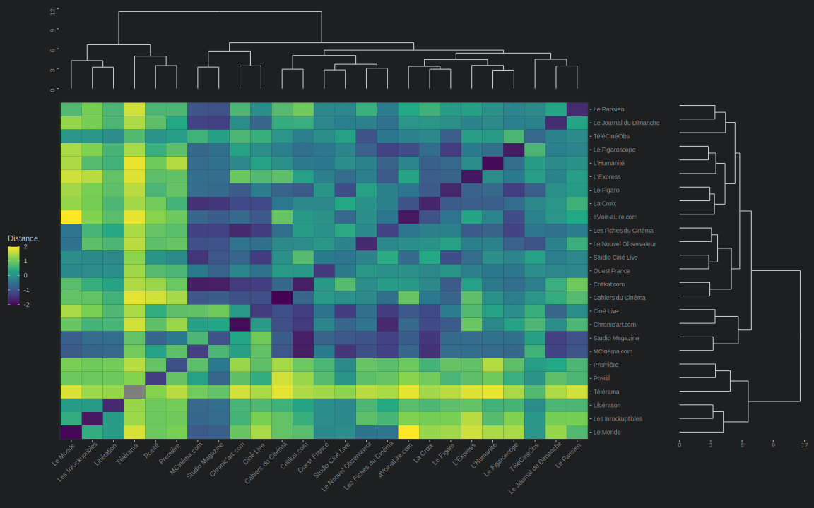

```{r setup, include = FALSE}
knitr::opts_chunk$set(
  warning = FALSE,
  message = FALSE,
  collapse = TRUE,
  fig.align = "center",
  comment = "#>"
)
library(tidyverse)
library(socscrap)
library(ggplot2)
library(glue)
library(thematic)
library(lubridate)
library(viridis)

data(ratings)
data("report")

ratings <- ratings %>%
  filter(!is.na(rating)) %>%
  mutate(year = year(date)) %>%
  filter(year >= 2000)

keep_main_papers <- function(.db, n = 25) {
  main25 <- ratings %>%
    count(paper, sort = T) %>%
    head(n) %>%
    pull(paper)
  
  .db %>%
    filter(paper %in% main25)
}

thematic_on(bg = "#1d1f21", fg = "#c5c8c6", accent = "#c5c8c6")
crossbar_col <- "#373b41"

```

# Présentation générale

Définitions & usages

## Qu'est-ce que le webscraping ?

+ **Extraire des informations** d'une page web pour en faire **un usage détourné**.
+ *Producteurs du site -> usage premier* : poser une question, discuter avec des ami·e·s, partager un logiciel, archiver des photos, etc.
+ *Usagers -> comment en faire un usage différent ?*
+ Le webscraping est un des moyens d'en faire un usage détourné.

## Quels usages détournés ?

+ Faire un moteur de recherche
+ Récolter des adresses emails pour du spam (ou [voler des mots de passe](https://github.com/search?o=desc&q=filename%3Asftp-config.json+password&ref=searchresults&s=indexed&type=Code&utf8=%E2%9C%93))
+ Recevoir un message quand une page web change
+ [Remporter automatiquement des enchères](https://www.youtube.com/watch?v=sgz5dutPF8M)
+ [S'inscrire automatiquement à des concours sur Twitter](https://www.youtube.com/watch?v=iAOOdYsK7MM&t=928s)
+ Archiver une page web dans Zotero
+ Créer une base de données pour réaliser des traitements statistiques

##


## Quand faut-il scraper ?

| Méthode | Avantages | Inconvénients |
| :----: | ---- | ---- |
| Webscraping | Furtif ; interface ; contrôle ; ludique | Légalité floue ; complexité ; éphémère |
| API | Légal si CGU ; données nettoyées ; requêtes simples ; durabilité | Limites ; prix ; inscription ; pas d'interface |
| Accès direct à la base de données | Légal ; informations nettoyées ; pas de programmation ! | négociation ; pas de contexte / contrôle |

## Usages en sciences sociales

+ **Visible** pour les terrains en ligne
+ **Invisible/invisibilisé** dans d'autres recherches : complément d'information

# Vision d'ensemble

Les grands principes du webscraping

## Comment ça marche ?

+ Le webscraping tire parti d'**un principe simple : les pages web sont générées
par un processus automatique et déterministe**
+ Les sites réutilisent la même
structure et la même mise en forme pour afficher différentes informations
+ *Par conséquent*, en comprenant ce processus automatique et déterministe,
alors **nous pouvons automatiser la récupération de ces informations**.

## Deux corollaires

0. **Moins le processus de génération d'un site est déterministe** (écriture manuelle, génération aléatoire de contenu comme dans les pages personnalisées ou la vente de billets d'avion), **moins le webscraping est efficace.**
1. Pour écrire un bon webscraper, **il faut comprendre un minimum d'éléments sur la production de sites web**.

## Oui, mais comment ça marche ?

En pratique, notre bot va procéder en deux temps :

0. **Le scraper** : *extraire les informations sur un certain type de page* (email d'une archive, liste de tweets, page d'un topic sur un forum)
1. **Le crawler** : *naviguer de lien en lien pour pointer le scraper vers toutes les pages pertinentes* (listes des emails dans un thread, liste de profils, listes de threads d'un forum)

## Crawler / scraper

<center>
```{r scrap_crawl, echo=FALSE}
DiagrammeR::grViz('
digraph {
  bgcolor = "#1d1f21";
  rankdir = LR;

  edge[color = "#c5c8c6", arrowsize = 0.5]

  node[shape = circle, fixedsize = true, penwidth = 2, fontsize = 8,
       fontname = "Arial", color = "#c5c8c6", fontcolor = "#c5c8c6"]
  Crawler
  Scraper
  
  node[shape = box, group = fbranch, color = "#b5bd68", fontcolor = "#b5bd68"]
  P1[label="Page 1"]
  P2[label="Page 2"]
  P3[label="Page ..."]
  P4[label="Page n"]
  
  node[shape = box, color = "#81a2be", fontcolor = "#81a2be"]
  L1[label="Ligne 1"]
  L2[label="Ligne 2"]
  L3[label="Ligne ..."]
  L4[label="Ligne n"]
  
  DATA[shape = none, color = "#cc6666", fontcolor = "#cc6666",
       label=<
  <TABLE BORDER="0" CELLBORDER="1" CELLSPACING="0">
  <TR><TD>Ligne 1</TD></TR>
  <TR><TD>Ligne 2</TD></TR>
  <TR><TD>Ligne ...</TD></TR>
  <TR><TD>Ligne n</TD></TR>
  </TABLE>
  >];
  
  Crawler->P1:w
  Crawler->P2:w
  Crawler->P3:w
  Crawler->P4:w
  P1:e->Scraper:nw
  P2:e->Scraper:w
  P3:e->Scraper:w
  P4:e->Scraper:sw
  Scraper->L1:w
  Scraper->L2:w
  Scraper->L3:w
  Scraper->L4:w
  L1:e->DATA:w
  L2:e->DATA:w
  L3:e->DATA:w
  L4:e->DATA:w
}
')
```

</center>

## Comment se représenter un scraper ?

0. Comme *un robot qui naviguerait sur un site très très rapidement*, comme si nous le
faisions avec notre navigateur.
1. Il peut être utile de *tirer profit du fait que notre robot ne "voit" pas exactement ce que nous voyons*.
2. Dans certains cas, il peut être souhaitable que *notre robot se comporte de manière moins "robotique"*.

## Quelles sont les grandes étapes ?

0. Concevoir un **scraper minimal** (récupère une information sur une page)
1. Puis **concevoir le crawler** qui va donner les pages pertinentes au scraper
2. *Améliorer le crawler* (stockage de données, etc.)
3. *Enrichir le scraper* avec des informations supplémenaires

## Quel langage pour faire du scraping ?

+ **Le langage mal adapté qu'on connaît mal vaut toujours mieux qu'un langage parfait qu'on ne connaît pas**
+ R évidemment (paquet `rvest`) -> bien *pour débuter, scraping de base*.
+ Python (`mechanize`, `scrapy`) -> pour *les projets les plus ambitieux*.
+ Selenium ? -> pour *les cas désespérés*.

## Quelles connaissances sont nécessaires ?

+ Débutant : **HTML**
+ Débutant : **CSS**
+ Débutant : **XPath** (1.0 pour `rvest`, 2.0 pour Python et cie)
+ Intermédiaire : *REGEX*
+ Intermédiaire : requêtes *POST*
+ Intermédiaire : *HEADERS*
+ Intermédiaire : *cookies*
+ Avancé : *Javascript*

# Notre exemple : Allociné

## Pourquoi Allociné ?

+ *Projet de recherche* plausible : espace des critiques cinématographiques
+ Un projet d'ampleur raisonnable : **collecter toutes les notes de films** sur Allociné
+ Le site Allociné est **(plutôt) simple à scraper**

## La page cible (scraper)


## L'index (crawler)


## Et concrètement ?

+ **Tous les films parus entre 2000 et 2020** (avec une note de presse)
+ soit **`r sum(report$films)` films**
+ et **`r sum(report$ratings)` notes** de presse
+ récoltées en **`r round(sum(report$duration)/3600, 1)` heures**
+ avec `r as.character(sum(report$films)*2+floor(sum(report$films)/15))` requêtes, **soit `r as.character(round((sum(report$films)*2+floor(sum(report$films)/15))/sum(report$duration), 1))` requêtes par seconde**.

## Distribution des évaluations (étoiles)

```{r ratings, echo=FALSE}
ratings %>%
  ggplot(aes(x = rating)) +
  geom_bar() +
  labs(x = "Note (étoiles)", y = "",
       title = "Distribution des évaluations presse",
       caption = "Données : Allociné, films avec avis presse")
```

## Au fil du temps

```{r ratings_over_years, echo=FALSE}
ratings %>%
  group_by(year) %>%
  summarise(mean_rating = mean(rating),
            sd_rating = sd(rating),
            min_sd = mean(rating) - sd(rating),
            max_sd = mean(rating) + sd(rating)) %>%
  ggplot(aes(x = year, y = mean_rating, fill = sd_rating)) +
  geom_crossbar(aes(ymin = min_sd, ymax = max_sd), colour = crossbar_col) +
  scale_fill_viridis() +
  labs(x = "", y = "Note (étoiles)",
       fill = "Écart-type",
       title = "Évolution des évaluations presse au fil des ans",
       caption = "Données : Allociné, films avec avis presse")
```

## Selon la revue

```{r ratings_by_paper, echo=FALSE}
ratings %>%
  keep_main_papers() %>%
  mutate(paper = factor(paper)) %>%
  group_by(paper) %>%
  summarise(nb_rating = n(),
            mean_rating = mean(rating),
            sd_rating = sd(rating),
            min_sd = mean(rating) - sd(rating),
            max_sd = mean(rating) + sd(rating)) %>%
  mutate(paper = glue("{paper} (n = {nb_rating})")) %>%
  ggplot(aes(x = fct_reorder(paper, mean_rating),
             y = mean_rating,
             fill = sd_rating)) +
  geom_crossbar(aes(ymin = min_sd, ymax = max_sd),
                colour = crossbar_col) +
  coord_flip() +
  scale_fill_viridis() +
  labs(x = "", y = "Note (étoiles)",
       fill = "Écart-type",
       title = "Distribution des évaluations selon la revue",
       caption = "Données : Allociné, films avec avis presse")
```

## Dans le temps, par revue

```{r ratings_by_paper_time, echo=FALSE}
ratings %>%
  keep_main_papers() %>%
  group_by(year, paper) %>%
  summarise(mean_rating = mean(rating),
            sd_rating = sd(rating),
            min_sd = mean(rating) - sd(rating),
            max_sd = mean(rating) + sd(rating)) %>%
  ggplot(aes(x = year, y = mean_rating, fill = sd_rating)) +
  geom_crossbar(aes(ymin = min_sd, ymax = max_sd),
                colour = crossbar_col) +
  facet_wrap(~ paper) +
  scale_fill_viridis() +
  theme(axis.text.x = element_text(angle = 45, hjust = 1)) +
  labs(x = "", y = "Note (étoiles)",
       fill = "Écart-type",
       title = "Évolution des évaluations presse au fil des ans",
       subtitle = "Pour chaque revue",
       caption = "Données : Allociné, films avec avis presse")
```

## De proche en proche



# Le paquet Socscrap

## Que contient Socscrap ?

+ Un scaper Allociné **prêt à l'emploi** : `get_ratings(2017)`
+ Des *fonctions intermédiaires* : `get_film_metadata(url)`
+ Des *fonctions générales* : `get_text(".class")`
+ Les **données collectées** disponibles : `data(ratings)`
+ *Statistiques d'extraction* : `data(report)`
+ Quelques *vignettes explicatives* : `vignette("allocine-scraper")`
+ **Le code disponible** sur : [gaalcaras/socscrap](https://github.com/gaalcaras/socscrap)

## Comment ça marche ?

<center>
```{r fn_dependency_graph, echo=FALSE}
DiagrammeR::grViz('
digraph {
  bgcolor = "#1d1f21";
  rankdir = LR;

  edge[color = "#c5c8c6"]

  node[shape = box, penwidth = 2,
       fontname = "Arial", color = "#c5c8c6", fontcolor = "#c5c8c6"]
  F1[label="get_ratings"]
  F2[label="process_filmlist"]
  F3[label="get_film_ratings"]
  F4[label="get_film_metadata"]
  F5[label="get_press_ratings"]
  F6[label="get_text"]
  
  F1->F2->F3;
  F3->F4;
  F3->F5;
  F5->F6;
}
', height = 200)
```

</center>

+ **6 fonctions**, du plus haut niveau (`get_ratings`) au plus bas (`get_text`)
+ *Aide disponible* pour chacune : `?get_ratings`
+ Pour s'entraîner :
  + **De haut en bas** : commencer par utiliser `get_ratings`, puis la coder soi-même ; puis remplacer `process_filmlist` ; puis `get_film_ratings`
  + **De bas en haut** : en s'aidant du code du paquet

## Testez le !

```{r yolo}
get_ratings(2017, pages = 4)
```

# Premiers pas

## La page cible (scraper)

https://www.allocine.fr/film/fichefilm-215099/critiques/presse/


## À quoi ressemble le scraper ?

```{r scaper_page}
"https://www.allocine.fr/film/fichefilm-215099/critiques/presse/" %>%
  get_film_ratings()

```

## Que fait le scraper ?

<center>
```{r scraper_fn_graph, echo=FALSE}
DiagrammeR::grViz('
digraph {
  bgcolor = "#1d1f21";
  rankdir = LR;

  edge[color = "#c5c8c6"]

  node[shape = box, penwidth = 2,
       fontname = "Arial", color = "#c5c8c6", fontcolor = "#c5c8c6"]
  F3[label="get_film_ratings"]
  F4[label="get_film_metadata"]
  F5[label="get_press_ratings"]
  
  node[shape = box, penwidth = 2,
       fontname = "Arial", color = "#b5bd68", fontcolor = "#b5bd68"]
  P4[label="Fiche du film"]
  P5[label="Notes presse\n du film"]
  
  node[shape = box, penwidth = 2,
       fontname = "Arial", color = "#f0c674", fontcolor = "#f0c674"]
  D4[label="Métadonnées"]
  D5[label="Notes presse"]
  
  node[shape = box, penwidth = 0,
       fontname = "Arial", color = "#cc6666", fontcolor = "#cc6666"]
  D0[label=<
  <TABLE BORDER="0" CELLBORDER="1" CELLSPACING="0" CELLPADDING="5">
  <TR><TD>Notes</TD><TD>Métadonnées</TD></TR>
  </TABLE>
  >]
  
  F3->F4;
  F3->F5;
  F4->P4;
  F5->P5;
  P4->D4;
  P5->D5;
  D4->D0;
  D5->D0;
}
')
```

</center>

## `get_press_ratings`

```{r film_ratings}
"https://www.allocine.fr/film/fichefilm-215099/critiques/presse/" %>%
  get_press_ratings()

```

## `get_film_metadata`

```{r film_metadata}
"https://www.allocine.fr/film/fichefilm_gen_cfilm=215099.html" %>%
  get_film_metadata()

```

## Page cible secondaire : fiche film


## L'inspecteur

+ **L'outil indispensable** du webscraping
+ Aller sur la page : https://www.allocine.fr/film/fichefilm_gen_cfilm=215099.html
+ *Clic-droit* sur une page
+ Dans Firefox : `Ctrl+Shift+K`
+ Dans Chromium : `Ctrl+Shift+I`

## Que voit-on dans la console ?

+ À peu près tous **les échanges entre le navigateur et le serveur** :
  + *Requêtes* : HTTP (`GET`, `POST`, `HEADERS`) -> onglet Network
  + *Affichage d'une page* : texte, HTML, CSS
  + *Stockage client* : cookies -> Network
  + *Code dynamique* : Javascript -> Network, Console
+ Le code est **interprété / exécuté** par le navigateur

## Afficher une page web

+ **Le texte de la page lui-même**
+ **HTML (HyperText Markup Language)** : langage dit « de balisage »
  (*markup language*)
  + *annoter* un texte avec des informations supplémentaires
  + usage canonique : décrire *la structure* (en-tête, paragraphe) ou bien *sa sémantique* (emphase, citation)
  + en pratique : aussi utilisé pour la mise en page
+ **CSS (Cascading StyleSheets)** : *mise en page* (position, couleur, arrière-plan)

## Manipuler une page web

+ Manipuler ces pages web pour **interagir** avec les internautes
+ Implique une **communication avec le serveur**
+ **HTTP (HyperText Transfer Protocol)** :
  + *protocole* de communication
  + *voir une page* : HTTP `GET`
  + *remplir un formulaire* de contact : HTTP `POST`
+ **Javascript** : langage de programmation -> *aspect dynamique* des pages (chat, masquage, infinite scroll, ...)

## HTML : code

Balises imbriquées :

```html
<div>
  <p>Liste à puces</p>
  <ul>
    <li>Élément 1</li>
    <li>Élément 2</li>
  </ul>
</div>
```

## HTML : arborescence

Balises = nœud (node)

<center>
```{r html_graph, echo=FALSE}
DiagrammeR::grViz('
digraph {
  bgcolor = "#1d1f21";
  rankdir = LR;

  edge[color = "#c5c8c6"]

  node[shape = box, penwidth = 2, fixedsize = TRUE,
       fontname = "Arial", color = "#c5c8c6", fontcolor = "#c5c8c6"]
  div;p;ul;
  li1[label="li"]
  li2[label="li"]

  div->p;
  div->ul;
  ul->li1;
  ul->li2;
}
')
```
</center>

## HTML : XPATH

```
//div/ul/li
```

<center>
```{r html_graph2, echo=FALSE}
DiagrammeR::grViz('
digraph {
  bgcolor = "#1d1f21";
  rankdir = LR;

  edge[color = "#c5c8c6"]

  node[shape = box, penwidth = 2, fixedsize = TRUE,
       fontname = "Arial", color = "#c5c8c6", fontcolor = "#c5c8c6"]
  div;p;ul;
  li1[label="li"]
  li2[label="li"]

  div->p;
  div->ul;
  ul->li1;
  ul->li2;
}
')
```
</center>

## CSS

```html
<div>
  <p>Liste à puces</p>
  <ul>
    <li class="rouge">Élément 1</li>
    <li class="jaune">Élément 2</li>
  </ul>
</div>
```

## En pratique

+ Exercice : **récupérer la date de sortie du film**
+ Utiliser *l'inspecteur*
+ Puis la fonction `get_text()` (de `soscrap`)

## Solution

```{r, solution}
"https://www.allocine.fr/film/fichefilm_gen_cfilm=215099.html" %>%
  xml2::read_html() %>%
  get_text(".date")
```

# Paquets utiles

## Tidyverse

```{r pipe_demo}
rnorm(100) %>%
  mean()
```

+ Un ensemble de paquets qui viennent redéfinir l'usage de R : `dplyr`, `forcats`, `stringr`, `lubridate`, ...
+ **Systématiser et optimiser** de nombreux aspects de R
+ Le symbole `%>%` (*pipe*) qui devient vite indispensable (paquet `magrittr`)

## Here

```{r here, eval=FALSE}
read_csv(here::here("data", "enquete_emploi.csv"))
```

+ Chemin *toujours relatif à la racine du projet* (projet RStudio, paquet R, dépôt git, ...)
+ Code *compatible avec tous les systèmes d'exploitation* (Linux, macOS, windows, ...)
+ Plus de `setwd()`, enfin des chemins **reproductibles** !


## Glue

```{r glue}
library(glue)

glue("Adieu", "horrible", "paste()", .sep = " ")

a <- 41

glue("La réponse à votre question est {a+1}.")
```

+ **Adieu, horribles fonctions** `paste()` et `collapse()`
+ Enfin une fonction dans R pour **formater des variables simplement** (`fstrings` dans Python 3.8, `printf` chez UNIX, ...)

## Rvest et xml2

+ Des fonctionnalités rudimentaires mais suffisantes pour faire un scraper simple dans R

# Écrire des fonctions dans R

## Faire ses propres fonctions, à quoi bon ?

+ **Factorisation** :
  + *Économie de moyens* : au lieu de faire des copier-coller
  + *Reproductible* : utiliser une fonction dans une boucle
  + *Maintenance* : on peut changer le comportement du code en modifiant seulement une fonction
+ **Lisibilité** :
  + Au lieu de (trop) commenter, écrire du code *qui parle de lui-même*
  + Bénéficier d'un *nom de fonction* (un *verbe*) évocateur
  + *Regrouper des lignes* dans un ensemble cohérent
  + *Cacher de la complexité inutile*

## Rappels

```{r func_demo}
nom_de_la_fonction <- function(arg1, arg2 = FALSE) {
  result <- arg1
  
  if(arg2) {
    result <- arg1 + arg2
  }
  
  # Le retour de la fonction est implicite dans R
  result
}

nom_de_la_fonction(3)
```
## Écrire de meilleures fonctions

+ **Informer** : utiliser `message()` plutôt que `print()`
+ **Arrêter** : en cas d'erreur, `stop()` avec un message d'erreur clair
+ **Plusieurs retours** : `return()` pour forcer un retour
+ **Vérifier les arguments** :
  + ``rlang::is_missing()`` pour les arguments normaux
  + Avancé : si tidyeval, ``rlang::quo_is_missing()``
+ **Écrire des tests unitaires** : voir le paquet `testthat`
  
## Exemple

```{r, better_func_demo}
nom_de_la_fonction <- function(arg1, arg2 = FALSE) {
  if(rlang::is_missing(arg1)) {
    return(NA)
    stop("Vous avez oublié de donner 'arg1'!")
  }
  
  result <- arg1
  
  if(arg2) {
    message("On ajoute arg2")
    result <- arg1 + arg2
  }
  
  result
}
```

# Programmation fonctionnelle

Ou comment j'ai appris à ne plus m'en faire et à aimer les boucles


## Rappel : les boucles dans R

```{r boucles}
pages <- c(1, 2, 3)
films <- tibble(
  titre = character(),
  real = character(),
)

for (page in pages) {
  films <- films %>%
    add_row(tibble(titre = glue("Film {page}"),
                   real = glue("Real {page}"))
            )
}
```

Qu'est-ce que j'obtiens si je fais `print(films)` ?

## Rappel : les boucles dans R

```{r boucles_solution}
pages <- c(1, 2, 3)
films <- tibble(
  titre = character(),
  real = character(),
)

for (page in pages) {
  films <- films %>%
    add_row(tibble(titre = glue("Film {page}"),
                   real = glue("Real {page}"))
            )
}

print(films)
```

## Le problème avec les boucles

```{r loop_hell, eval=FALSE}
for(annee in annees) {
  for(page in pages) {
    for(film in films) {
      for (note in notes) {
        return(toutes_les_notes)
      }
      films %>%
        add_row(...)
    }
  }
  return(films %>%
           add_column(annee = annee))
}
```

Quels problèmes ?

## Le problème avec les boucles

```{r loop_hell2, eval=FALSE}
for(annee in annees) {
  for(page in pages) {
    for(film in films) {
      for (note in notes) {
        return(toutes_les_notes)
      }
      films %>%
        add_row(...)
    }
  }
  return(films %>%
           add_column(annee = annee))
}
```

Quels problèmes ?

+ "Enfer de l'indentation" (lisibilité)
+ Incertitude sur l'action de la boucle

## Des boucles...

```{r boucles_ex}
pages <- c(1, 2, 3)
films <- tibble(
  titre = character(),
  real = character(),
)

for (page in pages) {
  films <- films %>%
    add_row(tibble(titre = glue("Film {page}"),
                   real = glue("Real {page}"))
            )
}

print(films)
```

## Aux cartes !

```{r map_1st}
library(purrr)

pages <- c(1, 2, 3)
films <- map_df(pages, ~ tibble(titre = glue("Film {.}"),
                                real = glue("Real {.}"))
                )

print(films)
```

## Autres exemples

```{r map_examples}
map_chr(films$real, ~ str_extract(., "\\d"))

map_int(films$real, ~ as.integer(str_extract(., "\\d")))

map2_chr(films$titre, films$real, ~ glue("{.x} par {.y}"))
```

## Avantages de `purrr`

+ **Adieu à l'enfer de l'indentation !**
+ Le code peut s'écrire **linéairement** plutôt qu'en imbrication
+ **Le nom de la fonction indique ce qu'elle retourne** :
    + `map` : une liste
    + `map_int` : un vecteur d'`integers`
    + `map_chr` : un vecteur de texte
    + `map_df` : une base de données type tibble
    + ...
    
## Exemple d'utilisation dans le code

```{r map_real_example, eval=FALSE}
# Définir une fonction pour récupérer les évaluations des films
# d'une page à partir de son URL
get_ratings_from_page <- function(url) { ... }

# Récupération des URLs des pages des films de cette année
this_year_urls <- ...

# Lancer le scraping et retourner une base de données toute faite :)
this_year_ratings <- map_df(this_year_urls,
                            ~ get_ratings_from_page(.x))
```

## Caveat : que faire en cas d'erreur ?

```{r map_fails, warning=TRUE, error=TRUE}
urls <- c("https://google.com", "http://je-nexiste-pas.lol")

# Je récupère les nœuds de chaque page
resultat <- map(urls,
                ~ httr::GET(url) %>%
                  read_html() %>%
                  get_nodes())

print(resultat)
```

## Solution

```{r map_fails_solved}
urls <- c("https://google.com", "http://je-nexiste-pas.lol")

# Je récupère les nœuds de chaque page, en retournant des NA en cas d'échec
resultat <- map_chr(urls,
                    possibly(~ read_html(url) %>%
                           html_text(),
                         NA_character_
                ))

print(resultat)
```
